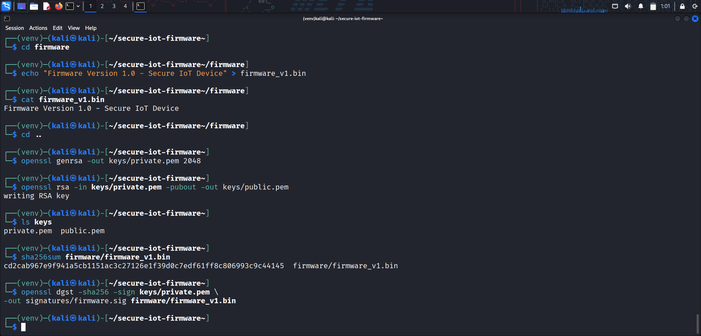
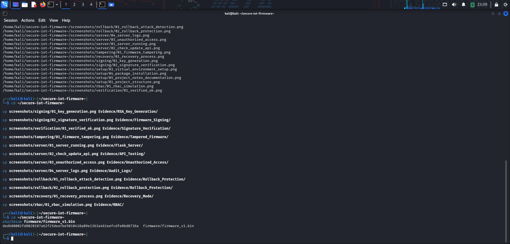
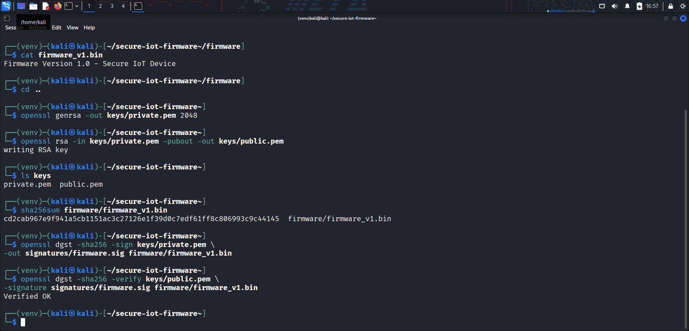
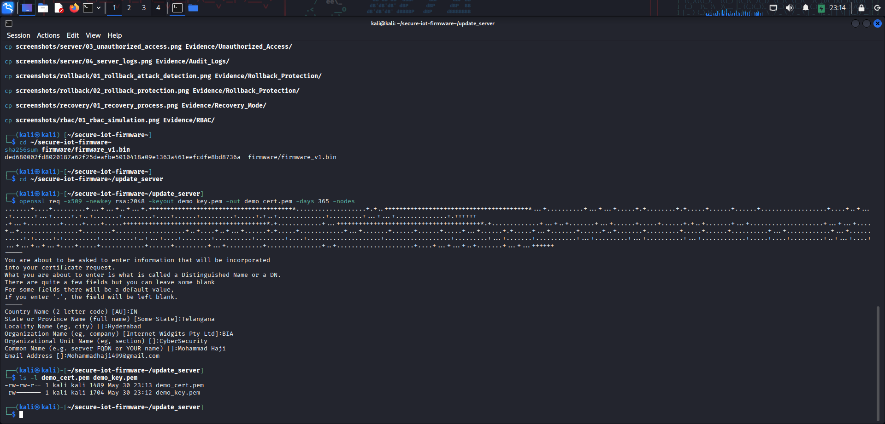
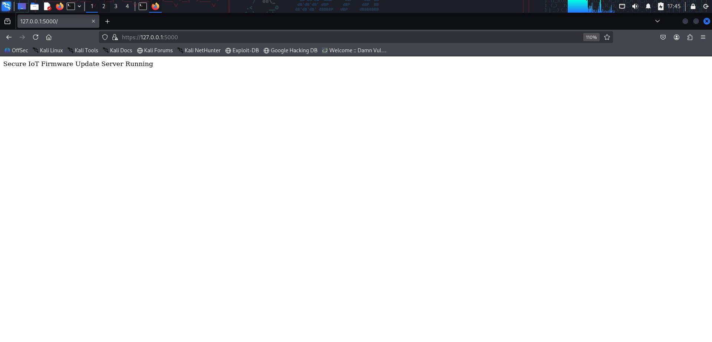
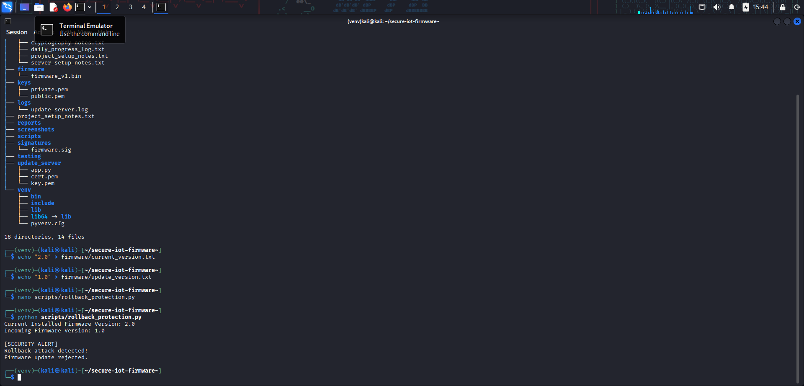
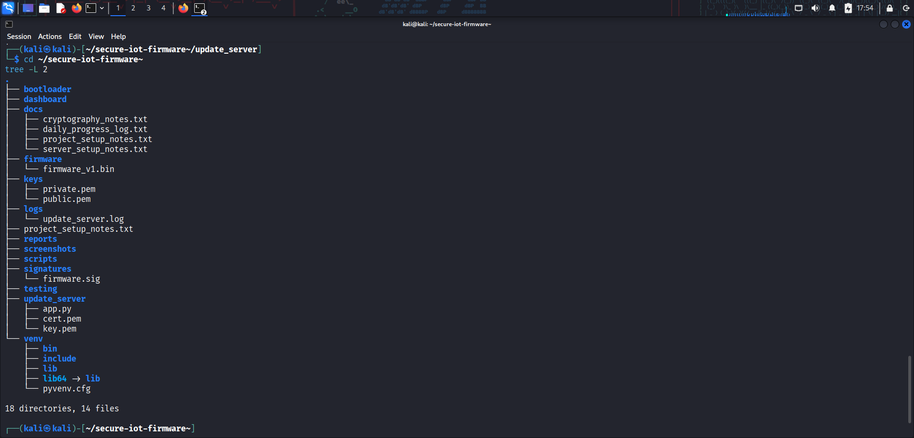

# 🔐 Secure Firmware Update Mechanism for IoT Devices
| Project | Status |
|---------|--------|
| Language | Python |
| Framework | Flask |
| Security | RSA, SHA-256, TLS |
| Platform | Kali Linux |
| License | MIT |


---
Firmware Developer
        │
        ▼
Generate Firmware
        │
        ▼
SHA-256 Hash
        │
        ▼
RSA Sign
        │
        ▼
HTTPS Flask Server
        │
        ▼
IoT Device
        │
        ▼
Verify Signature
        │
        ▼
Install Firmware

## 📖 Project Overview

This project demonstrates the implementation of a secure firmware update mechanism for IoT devices using modern security practices. It ensures that only trusted firmware is installed by combining cryptographic verification, secure communication, access control, audit logging, and firmware recovery techniques.

The project was developed as part of my Cybersecurity On-the-Job Training (OJT) to simulate a secure firmware deployment workflow commonly used in embedded and IoT environments.

---

## 🎯 Objectives

- Verify firmware authenticity using RSA Digital Signatures
- Validate firmware integrity using SHA-256 hashing
- Secure firmware delivery using HTTPS/TLS
- Prevent rollback attacks
- Implement Role-Based Access Control (RBAC)
- Maintain audit logs
- Support firmware recovery mode

---

## 🛠️ Technologies Used

### Programming

- Python
- Flask

### Security

- RSA Digital Signatures
- SHA-256
- TLS / HTTPS
- RBAC
- Audit Logging

### Environment

- Kali Linux
- Visual Studio Code
- VirtualBox

---

## 📁 Repository Structure

```text
secure-firmware-update-iot/

├── README.md
├── LICENSE
│
├── reports/
│   └── Final Project Report.pdf
│
├── source/
│   ├── rbac_simulation.py
│   ├── recovery_mode.py
│   └── rollback_protection.py
│
├── evidence/
│   ├── API_Testing/
│   ├── Audit_Logs/
│   ├── Firmware_Signing/
│   ├── Flask_Server/
│   ├── RBAC/
│   ├── Recovery_Mode/
│   ├── Rollback_Protection/
│   ├── RSA_Key_Generation/
│   ├── SHA256_Verification/
│   ├── Signature_Verification/
│   ├── Tampered_Firmware/
│   ├── TLS_Certificates/
│   └── Unauthorized_Access/
│
└── docs/
```

---

## 🛡️ Security Features Implemented

- RSA Key Generation
- Firmware Digital Signature Verification
- SHA-256 Integrity Verification
- Secure HTTPS Firmware Distribution
- TLS Certificate Configuration
- Role-Based Access Control (RBAC)
- Audit Logging
- Rollback Protection
- Recovery Mode

---
## 📸 Key Project Screenshots

### 🔑 RSA Key Generation



---

### 🔍 SHA-256 Verification



---

### ✍️ Firmware Signature Verification



---

### 🔒 TLS Certificate Generation



---

### 🌐 Flask HTTPS Server



---

### 🛡️ Rollback Protection



---

### 👥 RBAC Simulation



## 🧪 Testing & Validation

The project includes practical testing and validation for:

- RSA Key Generation
- Firmware Signing
- Signature Verification
- SHA-256 Verification
- TLS Certificate Generation
- Flask HTTPS Server
- API Testing
- Unauthorized Access Detection
- Audit Logging
- Firmware Tampering Detection
- Recovery Mode
- Rollback Protection
- RBAC Simulation

Supporting screenshots are available in the **evidence/** directory.

---

## ⚠️ Challenges Faced

During this project I worked through several practical challenges including:

- Configuring HTTPS with Flask
- Implementing firmware signature verification
- Managing cryptographic keys
- Organizing firmware validation workflow
- Structuring project documentation and evidence

---

## 🎓 Key Learning Outcomes

This project strengthened my practical understanding of:

- IoT Firmware Security
- Public Key Cryptography
- Secure Firmware Distribution
- Firmware Integrity Verification
- Secure Communication
- Access Control
- Security Documentation

---

## 🚀 Future Improvements

- Secure Boot Integration
- ECC-based Digital Signatures
- Hardware Security Module (HSM) Support
- Delta Firmware Updates
- Multi-device Update Management
- Cloud-based Firmware Distribution

---

## 👨‍💻 Author

**Mohammad Haji**

MCA Graduate | Cybersecurity Enthusiast | Application Security | Mobile Security | IoT Security

- GitHub: https://github.com/mohammadhaji7
- LinkedIn: https://linkedin.com/in/mohammadhajiwork

---

**This project was developed for educational purposes to demonstrate secure firmware update mechanisms and IoT security best practices.**
